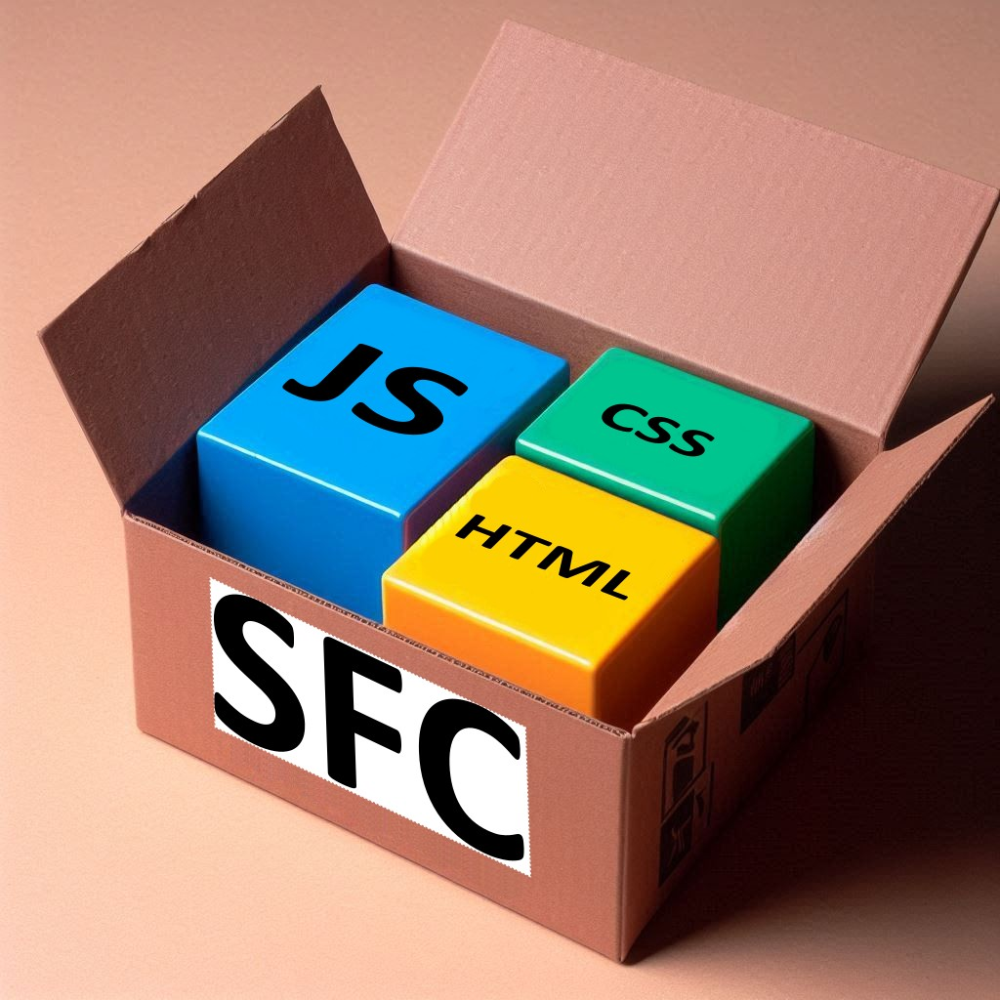

Single File Components got popular. The concept enables web developers to define the entire code of a component
in a compact way within a single file instead of

* separating style into a CSS file
* separating functionality into a JavaScript file
* separating html into a html file
* or creating a script that will create CSS and html at runtime.

So what is the value of spreading the implementation of a component into 3 files or executing JavaScript to create CSS rules instead of writing CSS ?


## Standard SFC components

There is no standard defining how SFC components work.  The **vue** framework has a good approach but the `*.vue` file
format is not containing standard html syntax as it supports artifacts like
``` txt
{ { expression } }
```

Looking into what the browsers support as standards a combinations if real HTML, CSS and JavaScript is preferable.

So let's combine all of these the way vue is proposing by using a file format that contains
valid HTML, CSS and JavaScript and create a standard web component <https://developer.mozilla.org/en-US/docs/Web/API/Web_components> from it:

``` html
<style> ... </style>
<template> ... </template>
<script> ... </script>
```

* `<style>` -- This top level tag will contain any css that is local to the component. It will be part of the Shadow DOM and has
  no side effect to the outside.

* `<template>` -- This top level tag will contain the initial HTML for the component. It will be part of the Shadow DOM and
  has no side effect to the outside.

* `<script>` -- This top level tag will contain the script to create the class for the component. The script is handled like a
  ES6 module exporting the class for using `CustomElementRegistry.define(...)`.  
  The class for the component must derive from the class `UComponent` that is implemented in `loader.js`.


Variations of this approach can be found in some articles on the internet:

* <https://ckeditor.com/blog/implementing-single-file-web-components/>


## Loading the component

In the browsers JavaScript and CSS includes have their specific syntax and of course none of these existing mechanisms
know how to handle SFC modules, that use the SFC file format. A loader function is implement to do the job that must be included:

``` html
<script src="/controls/loader.js"></script>
```

To load a component implementation the loadComponent function must be called. This function will load the components from the
specified path and returns a Promise that fulfills when all components have been loaded. This approach is adopted from the
`import()` function for dynamic module loading that also returns a promise.

``` javascript
loadComponent('my-colorpick', '/controls/').then(() => {
  console.log('all1 components loaded.');
});
```

<!--
  https://developer.mozilla.org/en-US/docs/Web/JavaScript/Guide/Modules
  import { name, draw, reportArea, reportPerimeter } from "./modules/square.js";
-->
